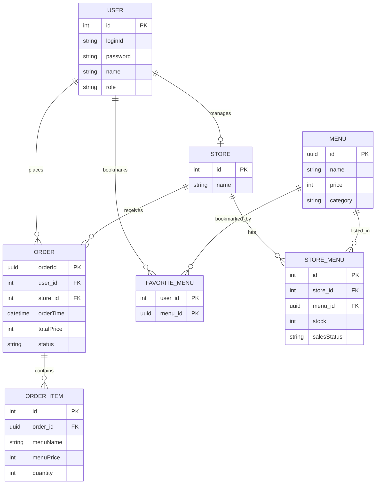

# ☕ My Doodle Cafe
> **골든 두들 강아지가 운영하는, 낙서 가득한 카페 주문 서비스**

---

## ✅ 핵심 기능 (Key Features)

### 1. 권한 기반 사용자 시스템 (RBAC)
- **Spring Security + JWT** 기반 역할별 접근 제어 (**CUSTOMER / SELLER / ADMIN**)
- `@PreAuthorize`를 활용한 API 엔드포인트 단위 접근 제한

### 2. 지점별 메뉴 관리 (Store-Menu System)
- 전역 메뉴(`Menu`)와 지점별 정보(`StoreMenu`) 분리로 **지점별 독립적인 재고 및 판매 상태** 지원
- 판매 상태 전이(**ON_SALE / READY / STOP / SOLD_OUT**) 및 추천 메뉴 관리

### 3. 주문 라이프사이클 관리
- 고객 주문 생성 및 실시간 **대기번호(Waiting Number) 발급**
- 판매자 전용 대시보드를 통한 주문 현황 조회 및 실시간 상태 변경

### 4. Redis 기반 보안 강화
- 로그아웃 시 **Redis Blacklist** 등록을 통한 토큰 무효화 및 TTL 적용
- 인증 필터에서 블랙리스트 토큰 검증 및 차단(401 Unauthorized)

---

## 🛠 Tech Stack

### 🚀 Backend
- **Core**: Java 17, Spring Boot 3.5.7
- **Security**: Spring Security, JWT
- **Data**: Spring Data JPA, Validation
- **Build**: Gradle, Lombok

### 💾 Database & Cache
- **RDB**: MySQL 8.x
- **Store**: Redis (Blacklist 기반 토큰 무효화)
- **Test**: H2 (JUnit5 통합 테스트용 인메모리 DB)

### 🎨 Frontend
- **Library**: React 19 (Vite), TypeScript
- **Styling**: Tailwind CSS
- **Routing/Comm**: React Router 7, Axios

---

### 🔄 Development Evolution
- **Architecture**: 초기 Thymeleaf(SSR) 구조에서 서비스 확장 및 UX 향상을 위해 **React(CSR) 기반 Full-stack 구조**로 리팩토링 진행 (레거시 코드는 아카이브 유지)

---

## 📊 데이터베이스 구조 (ERD)
> 서비스의 확장성과 데이터 무결성을 고려한 도메인 모델 설계입니다.

---

## 📚 Documentation

본 프로젝트의 문서는 Google Docs / Google Sheets로 관리됩니다.  

### 🔧 코딩 표준 (Java)

코드 스타일, 네이밍 규칙, 패키지 구조 등 프로젝트 전체에서 준수해야 할 기준입니다.  
👉 [CafeOrderPjt-코딩 표준 문서 - Google Docs](https://docs.google.com/document/d/1t4CU3E1Wy8qrvUH_B3rpXrbv-SVznBF2jNZkDivearw/edit?usp=sharing)

### 🗂️ 형상 관리 전략

브랜치 전략(Git Flow), 커밋 메시지 컨벤션, PR 규칙 등을 포함한 협업 규칙입니다.  
👉 [CafeOrderPjt-형상 관리 전략 - Google Docs](https://docs.google.com/document/d/1Piq6vFnKDsxStXEe4gU6eHP-d_bNreJHicGVY7oWtJw/edit?usp=sharing)

### 📡 API 설계서

API 엔드포인트, 요청/응답 스펙, 상태 코드 등이 정리된 Sheets 기반 명세서입니다.  
👉 [CafeOrderPjt-API 설계도 - Google Sheets](https://docs.google.com/spreadsheets/d/1FGEfHE_EKc6X4YT2fuyZ53a_tOM9Nic_aKHOO3aDZ0w/edit?usp=sharing)

---
